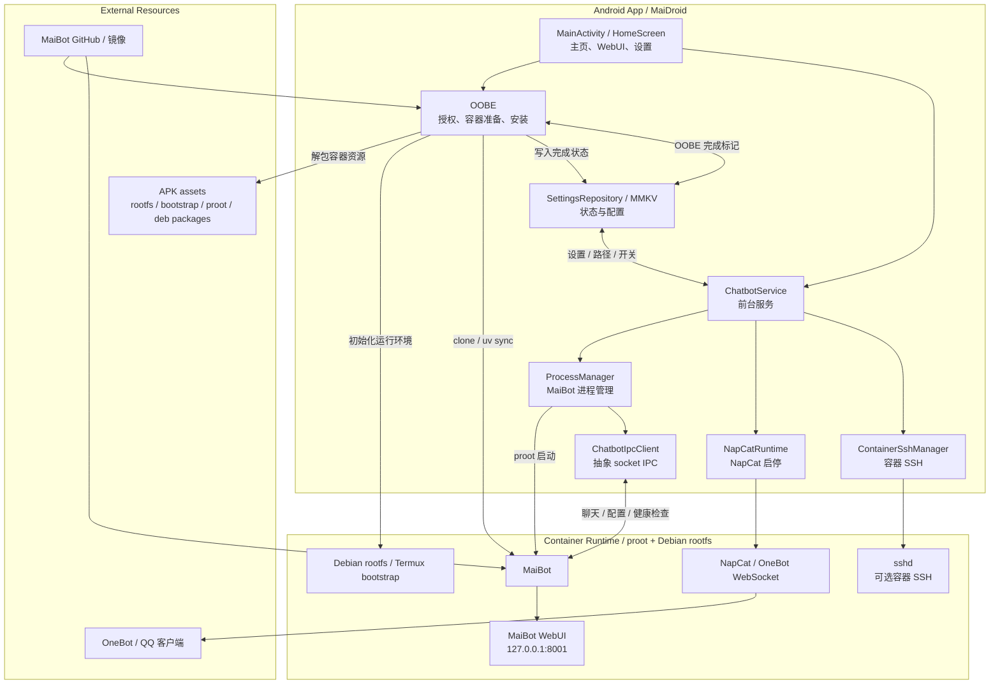

# MaiDroid

~~饺子醋x~~

~~本质是为了完善MaiWeb官网而做的安卓APP~~

你说得对，但是 MaiDroid 是一个面向 Android 设备的 MaiBot 运行方案，目标是在移动端完成容器环境准备、MaiBot 部署以及基础运行管理。

当前仓库已经包含以下主要模块：

- OOBE 配置页和安装流程
- 容器资源解包
- 前台服务
- 开机自启控制
- MaiBot 容器配置
- WebUI 页面
- 基础 IPC 客户端

## 当前能力

- 展示 OOBE，引导授权、准备容器并安装 MaiBot
- 解包内置的 Debian rootfs、bootstrap 和 proot 相关资源
- 启动前台服务，保持后台运行
- 打开 MaiBot WebUI
- 记录运行日志，便于排查问题
- 根据设置控制开机自动启动

## 仍待完善

- Android 与 MaiBot 的最终通信协议仍在收敛
- 稳定的消息闭环、健康检查和错误提示还需要补齐
- 无障碍、输入法、通知监听等能力尚未全部落地

## 架构图



这张图主要表达三层关系：

- Android 负责引导、配置、启动和管理
- 容器里跑 Debian / MaiBot / NapCat / sshd
- 外部资源来自 APK assets 和 GitHub 镜像，最终由 OOBE 拉起来

## 项目结构

- `app/src/main/java/org/maiwithu/maidroid/oobe/`：OOBE 安装流程
- `app/src/main/java/org/maiwithu/maidroid/container/`：容器资源、路径和安装脚本
- `app/src/main/java/org/maiwithu/maidroid/process/`：MaiBot 进程管理
- `app/src/main/java/org/maiwithu/maidroid/service/`：前台服务
- `app/src/main/java/org/maiwithu/maidroid/ui/`：主界面、OOBE 和 WebUI 页面
- `app/src/main/java/org/maiwithu/maidroid/ipc/`：Android 侧 IPC 客户端

## 本地构建

在 Windows PowerShell 中可以使用：

```powershell
.\gradlew.bat assembleDebug
```

构建产物通常位于 `app/build/outputs/`。

